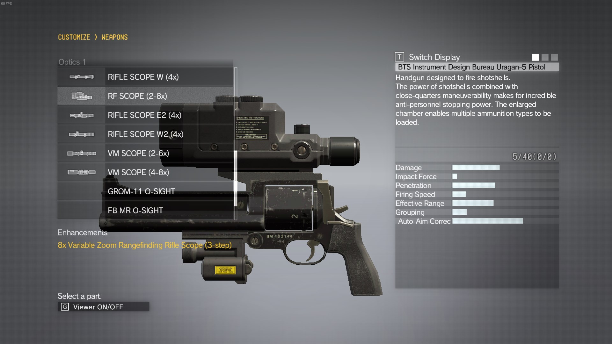
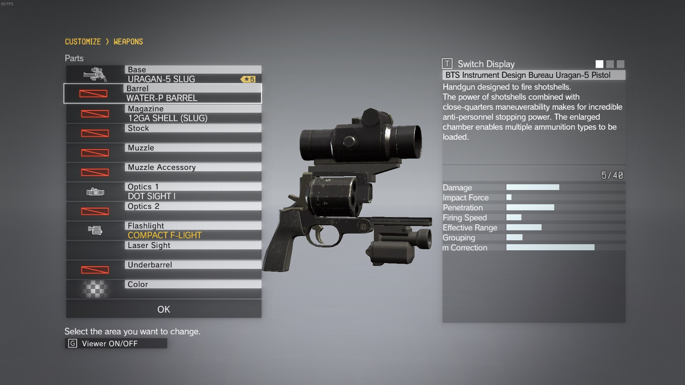
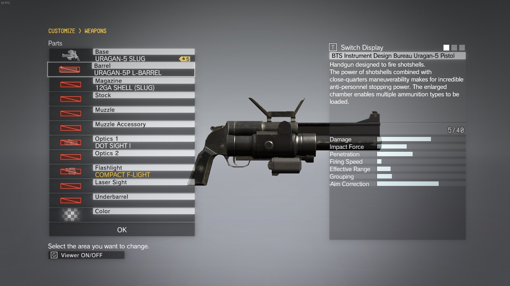
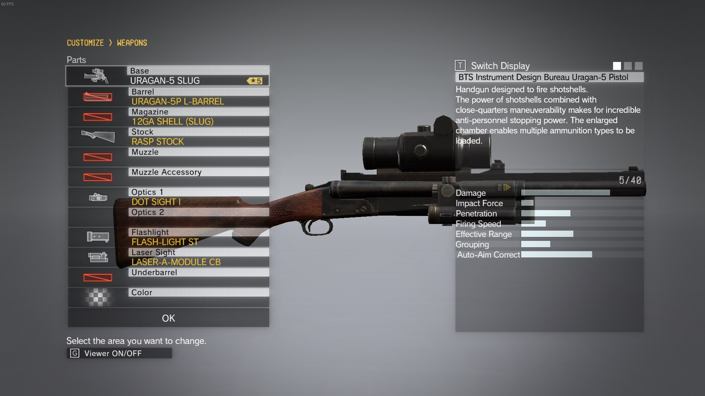
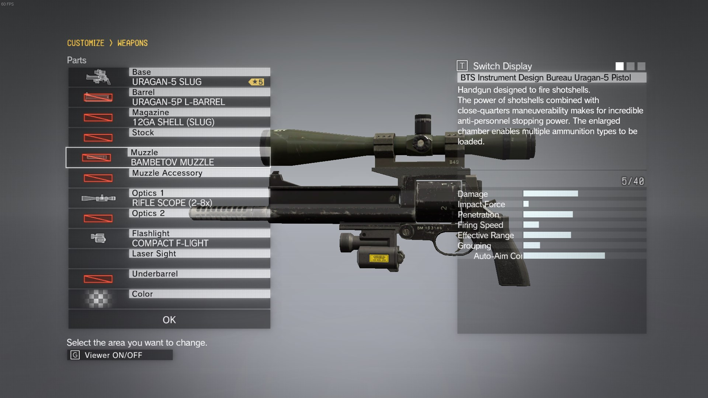
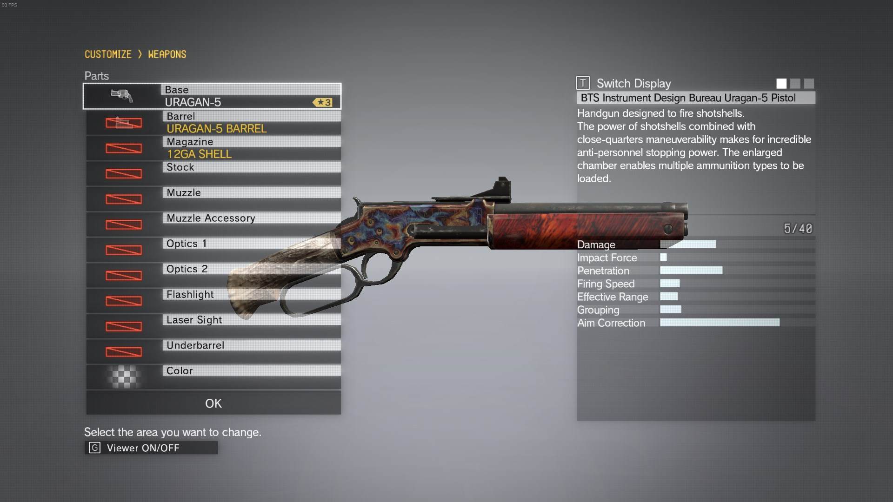

# mgsmonsterguns

How does a MGSV weapon work?
Every customizable weapon consists of parts (using URAGAN-5P SLUG as example):

type | id | localized string | description | notes
----|--------|----------|-------------|------
**Main**|
-|TppEquip.WP_10515|weapon id| self-explanatory|
0|TppEquip.RC_10515|URAGAN SG-FRAME| frame with open slots, usually one per gun grade|
1|TppEquip.BA_10504|URAGAN-5P L-BARREL| gun barrel, duh| 
**Optional**|
2|TppEquip.AM_10515|12GA SHELL (SLUG)| ammo type |
3|TppEquip.SK_None|-| stock | 
4|TppEquip.MZ_None|-| muzzle| attachable to barrel
5|TppEquip.MO_None|-| muzzle option | attachable to barrel
6|TppEquip.ST_20104|DOT SIGHT I|Scope (Upper Option Slot) | attachable to barrel
7|TppEquip.ST_None|-| Second scope slot
8|TppEquip.LT_10102|COMPACT F-LIGHT| Laser Sight 1 | attachable to barrel
9|TppEquip.LT_None|-| Laser Sight 2 | attachable to barrel
10|TppEquip.UD_None|-| Underbarrel/foregrip | attachable to barrel
-|number at the end|1-9|Weapon grade


These predefined parameters for each gun can be found in file `\master\0\00\Assets\tpp\level_asset\weapon\ParameterTables\parts\EquipParameters.lua` and vary from gun to gun (TppEquip.UD_None can be substituted by UB_None for example); color is not included. 
Note that some parameters are None by default - it means that frame used in this weapon doesn't allow changes in these slots.

If your gun's frame has litte to none open slots (marked red ingame), you can try to change the frame to another one with more options. However it may crash the game or hang it.

# Open slots

Let's say we want to change options for open slots such as scope. There are two ways of doing so:
* Changing it in `\master\0\00\Assets\tpp\level_asset\weapon\ParameterTables\parts\EquipParameters.lua` to another one. 
	* Pros: you will change every gun in the game including those that guards carry
	* Cons: small variety, you cannot select other scopes in game
* Adding more entries to `\master\0\00\Assets\tpp\motherbase\script\WeaponPartsCombinationSettings.lua`, expanding the list.
	* Pros: a lot of options
	* Cons: none

## Replacing options
First method speaks for itself: find a part you want on a gun, replace it (ie ST_20104 for ST_30305), save file, make a new customized gun.

## Adding more entries
Open `\master\0\00\Assets\tpp\motherbase\script\WeaponPartsCombinationSettings.lua`, find a frame for your gun - `RC_10515` for URAGAN-SG. There will be multiplie entries such as 
```
TppMotherBaseManagement.RegistPartsInclusionInfo{
	receiverID=
		{TppEquip.RC_10515},
	partsType=6,
	partsIds={
		TppEquip.ST_20104,
		TppEquip.ST_20205,
		TppEquip.ST_30114,
		TppEquip.ST_30305,
		TppEquip.ST_60102,
		TppEquip.ST_60001
	}
```
This code adds 6 allowed scopes (partsType=6) to URAGAN-SG, but we definitely need more. Feel free to expand that list with any scopes from the [table below](#tables). Save the file, make a new customized gun, choose from gorillion scopes. 


# Closed slots
Closed slots are cannot be changed via ingame interface at all, so you will need to modify them in lua scripts (or change the gun frame to another one with more slots).

Changing barrel: changes fine 

## Changing frame
Changing frame may cause crashes, hangs etc.

Open `\master\0\00\Assets\tpp\level_asset\weapon\ParameterTables\parts\EquipParameters.lua`, find your gun's frame - `RC_10515` for URAGAN-SG, replace it with another frame from the [table below](#tables).

Changing frame to ZORN: open slots are changed according to a new frame (no modifications allowed) saving previous options (optics and flashlights) 

Changing frame to RASP SG+P with more slots, game hangs on sortie prep: 

## Changing closed slots
Open `\master\0\00\Assets\tpp\level_asset\weapon\ParameterTables\parts\EquipParameters.lua`, find your gun's frame - `RC_10515` for URAGAN-SG, replace stuff below the line with the frame - TppEquip.SK_, TppEquip.MZ_ etc. with anything you want from the [tables below](#tables), save the file, make a new customized gun, the end. Save your gun, revert changes in file. 

Changing muzzle for a Bambetov one (MZ_60203) - 

# Replacing models

`\master\0\00\Tpp\Scripts\Equip\ChimeraPartsPackageTable.lua` has a list of 'package infos' - basically what models a gun / gun parts uses.
Code below says that URAGAN SG receiver is using package #220. Enumerate packages in the beginning of the file to find corresponding package, change whatever you want.
```
{
	TppEquip.RC_10515,
	220
},
```
Package #220:
```
{
	"/Assets/tpp/parts/weapon/hag/hg02_main0_def_v00.parts",
	"/Assets/tpp/pack/collectible/chimera/receiver/hg02_main0_def_v00.fpk",
	"/Assets/tpp/fova/weapon/hag/hg02_main0_def_cam.fv2",
	"/Assets/tpp/pack/collectible/fova/receiver/hg02_main0_def_cam.fpk",
	"/Assets/tpp/fova/weapon/hag/hg02_main0_def_clv.fv2",
	"/Assets/tpp/pack/collectible/fova/receiver/hg02_main0_def_clv.fpk",
	"/Assets/tpp/fova/weapon/hag/default/hg02_main0_def.fv2",
	"/Assets/tpp/pack/collectible/fova/receiver/hg02_main0_def.fpk"
},
```
replace first two strings with
```
"/Assets/tpp/parts/weapon/hag/hg05_main0_def.parts",
"/Assets/tpp/pack/collectible/secondary/EQP_WP_SkullFace_hg_010.fpk"
```
, get a Skullface-themed URAGAN.



# Notes
Deployment cost will change according to parts added, even if they were forced into closed slots.

Adding lethal ammo to non-lethal guns won't work (by adding more entries).

If you cannot see your guns on sortie prep or in ACC - this is a bad sign.

Changing frame usually leads to invisible guns (see above).

Changing gas pistol components leads to nothing. Looks like it cannot be changed because reasons.

Adding stocks and sights to WU pistol is a bad idea - you won't see anything.

WP_Volgin_sg_010 is most likely a shotgun from prologue. WP_Pr_sm_010 and everything with Pr in name is _probably_ prologue weapons too.

Skullface's 'shotgun' is actually a grade 4 handgun with WU S333 (revolver) barrel. Adding parts from 'shotgun' to WU S333 makes gun invisible and unusable, you can deploy with it, but cannot aim and shoot.

Lack of barrel makes gun invisible; infinite loading circle on customize screen.


# Tables

Tables are huge so I moved them to another page - http://unknown321.github.io/mgsmonsterguns/ along with this readme.
A spreadsheet with some basic info - http://forum.xentax.com/viewtopic.php?f=10&t=12407&p=123949#p123949

# Undoing things

vars.userPresetCustomizedWeapon - slots for weapons, 3 slots per weapon * 8 weapon types

vars.userPresetChimeraParts - customised slots per weapon, 288 total, 12 per weapon
```
local index = 0
while type(vars.userPresetCustomizedWeapon[index]) == 'number' do
      vars.userPresetCustomizedWeapon[index] = 0
      index = index + 1
end   
```

I also have other MGSV-related repos:

 * https://github.com/unknown321/mgsv_lua_dump - dump of (probably) all lua files in the game, made for changelogs
 * https://github.com/unknown321/mgswaifus - unique soldiers with photos and skills and everything else
 * https://github.com/unknown321/mgsvdump - dump of lua classes used in the game, useful for modding.
